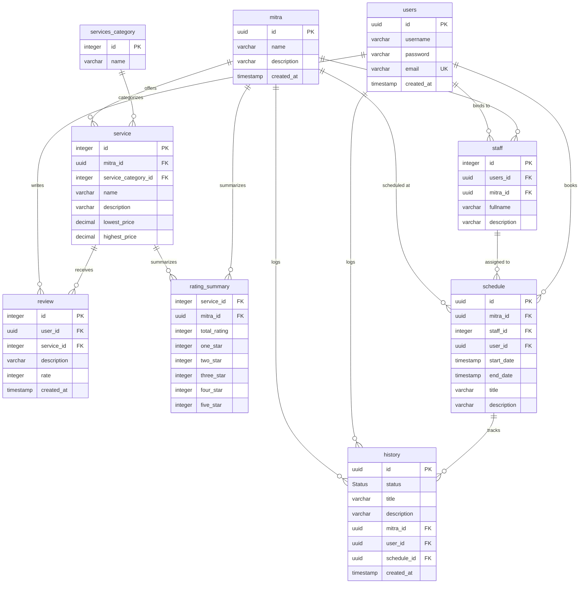

# Kuro E-Commerce Database Documentation

**Document Date:** June 7, 2026  
**Database Version:** v1.0.0  
**Database Engine:** PostgreSQL

---

## 1. Overview
This document provides a detailed overview and reference for the **Kuro E-Commerce** PostgreSQL database schema. The database is designed to support users, service providers (Mitra), staff members, categories, services, reviews, schedules, and historical transaction logs.

---

## 2. Entity-Relationship Diagram (ERD)

The following diagram illustrates the relationships between the database tables:



---

## 3. Data Types & Enums

### Custom Enum: `Status`
Represents the status of booking history.
- `'cancelled'`
- `'pending'`
- `'success'`

---

## 4. Table Schemas

### 4.1. Table: `users`
Stores details of registered users of the system.

| Column | Type | Constraints | Description |
| :--- | :--- | :--- | :--- |
| `id` | `uuid` | `PRIMARY KEY` | Unique identifier for the user (typically UUID v7). |
| `username` | `varchar` | `NOT NULL` | The unique identifier username for login. |
| `password` | `varchar` | `NOT NULL` | Hashed password. |
| `email` | `varchar` | `NOT NULL`, `UNIQUE` | Email address, used for login and notifications. |
| `created_at` | `timestamp` | `DEFAULT current_timestamp` | Timestamp of registration. |

---

### 4.2. Table: `mitra`
Stores information about partner entities/merchants (Mitra) providing services.

| Column | Type | Constraints | Description |
| :--- | :--- | :--- | :--- |
| `id` | `uuid` | `PRIMARY KEY` | Unique identifier for the partner. |
| `name` | `varchar` | `NOT NULL` | Name of the partner shop/business. |
| `description` | `varchar` | | Optional text description of the partner's offerings. |
| `created_at` | `timestamp` | `DEFAULT current_timestamp` | Timestamp of onboarding. |

---

### 4.3. Table: `services_category`
A dictionary table defining classifications/categories for services.

| Column | Type | Constraints | Description |
| :--- | :--- | :--- | :--- |
| `id` | `integer` | `PRIMARY KEY` | Unique numeric identifier for the category. |
| `name` | `varchar` | `NOT NULL` | The name of the category (e.g. "Cleaning", "Repairs"). |

---

### 4.4. Table: `staff`
Stores information about staff members employed by partners (Mitra). Each staff member is also linked to a user account.

| Column | Type | Constraints | Description |
| :--- | :--- | :--- | :--- |
| `id` | `integer` | `PRIMARY KEY` | Unique numeric identifier for the staff member. |
| `users_id` | `uuid` | `NOT NULL`, `FOREIGN KEY` | References `users(id)`. |
| `mitra_id` | `uuid` | `NOT NULL`, `FOREIGN KEY` | References `mitra(id)`. |
| `fullname` | `varchar` | `NOT NULL` | Full name of the staff member. |
| `description` | `varchar` | | Optional description or bio. |

---

### 4.5. Table: `service`
Details the specific services offered by partners.

| Column | Type | Constraints | Description |
| :--- | :--- | :--- | :--- |
| `id` | `integer` | `PRIMARY KEY` | Unique numeric identifier for the service. |
| `mitra_id` | `uuid` | `NOT NULL`, `FOREIGN KEY` | References `mitra(id)`. |
| `service_category_id` | `integer` | `NOT NULL`, `FOREIGN KEY` | References `services_category(id)`. |
| `name` | `varchar` | `NOT NULL` | The name of the service. |
| `description` | `varchar` | | Optional details about the service. |
| `lowest_price` | `decimal(12,2)` | | Minimum estimated price. |
| `highest_price` | `decimal(12,2)` | | Maximum estimated price. |

---

### 4.6. Table: `review`
Stores user reviews and ratings left for services.

| Column | Type | Constraints | Description |
| :--- | :--- | :--- | :--- |
| `id` | `integer` | `PRIMARY KEY` | Unique numeric identifier for the review. |
| `user_id` | `uuid` | `NOT NULL`, `FOREIGN KEY` | References `users(id)`. |
| `service_id` | `integer` | `NOT NULL`, `FOREIGN KEY` | References `service(id)`. |
| `description` | `varchar` | | Review text comment. |
| `rate` | `integer` | `NOT NULL`, `CHECK(rate >= 0 AND rate <= 5)` | Rating value (0 to 5). |
| `created_at` | `timestamp` | `DEFAULT current_timestamp` | Timestamp when review was submitted. |

---

### 4.7. Table: `rating_summary`
Aggregates ratings for services provided by partner shops to optimize querying performance.

| Column | Type | Constraints | Description |
| :--- | :--- | :--- | :--- |
| `service_id` | `integer` | `NOT NULL`, `FOREIGN KEY` | References `service(id)`. |
| `mitra_id` | `uuid` | `NOT NULL`, `FOREIGN KEY` | References `mitra(id)`. |
| `total_rating` | `integer` | `DEFAULT 0` | Total number of rating submissions. |
| `one_star` | `integer` | `DEFAULT 0` | Count of 1-star ratings. |
| `two_star` | `integer` | `DEFAULT 0` | Count of 2-star ratings. |
| `three_star` | `integer` | `DEFAULT 0` | Count of 3-star ratings. |
| `four_star` | `integer` | `DEFAULT 0` | Count of 4-star ratings. |
| `five_star` | `integer` | `DEFAULT 0` | Count of 5-star ratings. |

---

### 4.8. Table: `schedule`
Handles service appointments/schedules.

| Column | Type | Constraints | Description |
| :--- | :--- | :--- | :--- |
| `id` | `uuid` | `PRIMARY KEY` | Unique identifier for the schedule booking. |
| `mitra_id` | `uuid` | `NOT NULL`, `FOREIGN KEY` | References `mitra(id)`. |
| `staff_id` | `integer` | `NOT NULL`, `FOREIGN KEY` | References `staff(id)`. |
| `user_id` | `uuid` | `NOT NULL`, `FOREIGN KEY` | References `users(id)`. |
| `start_date` | `timestamp` | `DEFAULT current_timestamp` | Scheduled start time. |
| `end_date` | `timestamp` | `DEFAULT current_timestamp` | Scheduled end time. |
| `title` | `varchar` | `NOT NULL` | Appointment title. |
| `description` | `varchar` | | Appointment details. |

---

### 4.9. Table: `history`
Audit log/transaction history recording states of bookings.

| Column | Type | Constraints | Description |
| :--- | :--- | :--- | :--- |
| `id` | `uuid` | `PRIMARY KEY` | Unique history entry identifier. |
| `status` | `Status` | `NOT NULL` | Enum representing booking status (`cancelled`, `pending`, `success`). |
| `title` | `varchar` | `NOT NULL` | Log event title. |
| `description` | `varchar` | | Log event description. |
| `mitra_id` | `uuid` | `NOT NULL`, `FOREIGN KEY` | References `mitra(id)`. |
| `user_id` | `uuid` | `NOT NULL`, `FOREIGN KEY` | References `users(id)`. |
| `schedule_id` | `uuid` | `NOT NULL`, `FOREIGN KEY` | References `schedule(id)`. |
| `created_at` | `timestamp` | `DEFAULT current_timestamp` | Date and time when history event was created. |

---

## 5. Raw SQL Schema Code (`kuro.sql`)

```sql
CREATE TYPE "Status" AS ENUM (
  'cancelled',
  'pending',
  'success'
);

CREATE TABLE "users" (
  "id" uuid PRIMARY KEY,
  "username" varchar NOT NULL,
  "password" varchar NOT NULL,
  "email" varchar NOT NULL UNIQUE,
  "created_at" timestamp DEFAULT current_timestamp
);

CREATE TABLE "mitra" (
  "id" uuid PRIMARY KEY,
  "name" varchar NOT NULL,
  "description" varchar,
  "created_at" timestamp DEFAULT current_timestamp
);

CREATE TABLE "services_category" (
  "id" integer PRIMARY KEY,
  "name" varchar NOT NULL
);

CREATE TABLE "staff" (
  "id" integer PRIMARY KEY,
  "users_id" uuid NOT NULL,
  "mitra_id" uuid NOT NULL,
  "fullname" varchar NOT NULL,
  "description" varchar
);

CREATE TABLE "service" (
  "id" integer PRIMARY KEY,
  "mitra_id" uuid NOT NULL,
  "service_category_id" integer NOT NULL,
  "name" varchar NOT NULL,
  "description" varchar,
  "lowest_price" decimal(12,2),
  "highest_price" decimal(12,2)
);

CREATE TABLE "review" (
  "id" integer PRIMARY KEY,
  "user_id" uuid NOT NULL,
  "service_id" integer NOT NULL,
  "description" varchar,
  "rate" integer NOT NULL CHECK("rate" >= 0 AND "rate" <= 5),
  "created_at" timestamp DEFAULT current_timestamp
);

CREATE TABLE "rating_summary" (
  "service_id" integer NOT NULL,
  "mitra_id" uuid NOT NULL,
  "total_rating" integer DEFAULT 0,
  "one_star" integer DEFAULT 0,
  "two_star" integer DEFAULT 0,
  "three_star" integer DEFAULT 0,
  "four_star" integer DEFAULT 0,
  "five_star" integer DEFAULT 0
);

CREATE TABLE "schedule" (
  "id" uuid PRIMARY KEY,
  "mitra_id" uuid NOT NULL,
  "staff_id" integer NOT NULL,
  "user_id" uuid NOT NULL,
  "start_date" timestamp DEFAULT current_timestamp,
  "end_date" timestamp DEFAULT current_timestamp,
  "title" varchar NOT NULL,
  "description" varchar
);

CREATE TABLE "history" (
  "id" uuid PRIMARY KEY,
  "status" "Status" NOT NULL,
  "title" varchar NOT NULL,
  "description" varchar,
  "mitra_id" uuid NOT NULL,
  "user_id" uuid NOT NULL,
  "schedule_id" uuid NOT NULL,
  "created_at" timestamp DEFAULT current_timestamp
);

ALTER TABLE "review" ADD FOREIGN KEY ("user_id") REFERENCES "users" ("id");
ALTER TABLE "review" ADD FOREIGN KEY ("service_id") REFERENCES "service" ("id");

ALTER TABLE "rating_summary" ADD FOREIGN KEY ("service_id") REFERENCES "service" ("id");
ALTER TABLE "rating_summary" ADD FOREIGN KEY ("mitra_id") REFERENCES "mitra" ("id");

ALTER TABLE "staff" ADD FOREIGN KEY ("users_id") REFERENCES "users" ("id");
ALTER TABLE "staff" ADD FOREIGN KEY ("mitra_id") REFERENCES "mitra" ("id");

ALTER TABLE "service" ADD FOREIGN KEY ("mitra_id") REFERENCES "mitra" ("id");
ALTER TABLE "service" ADD FOREIGN KEY ("service_category_id") REFERENCES "services_category" ("id");

ALTER TABLE "schedule" ADD FOREIGN KEY ("mitra_id") REFERENCES "mitra" ("id");
ALTER TABLE "schedule" ADD FOREIGN KEY ("staff_id") REFERENCES "staff" ("id");
ALTER TABLE "schedule" ADD FOREIGN KEY ("user_id") REFERENCES "users" ("id");

ALTER TABLE "history" ADD FOREIGN KEY ("mitra_id") REFERENCES "mitra" ("id");
ALTER TABLE "history" ADD FOREIGN KEY ("user_id") REFERENCES "users" ("id");
ALTER TABLE "history" ADD FOREIGN KEY ("schedule_id") REFERENCES "schedule" ("id");
```
