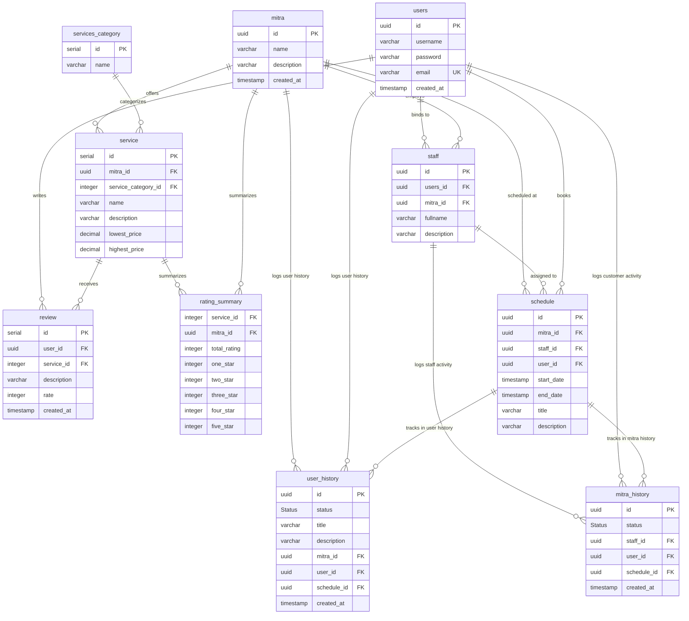

# Kuro E-Commerce Database Documentation

**Document Date:** June 7, 2026  
**Database Version:** v1.1.0  
**Database Engine:** PostgreSQL

---

## 1. Overview
This document provides a detailed overview and reference for the **Kuro E-Commerce** PostgreSQL database schema. The database supports users, service providers (Mitra), staff members, categories, services, reviews, schedules, and split transaction/event histories for both users and mitra.

> [!NOTE]
> As of version v1.1.0, the chat system is not yet supported in this schema and will be added at a later date. The `history` table has also been split into `user_history` and `mitra_history` tables.

---

## 2. Entity-Relationship Diagram (ERD)

The following diagram illustrates the updated relationships between the database tables:



---

## 3. Data Types & Enums

### Custom Enum: `Status`
Represents the status of bookings and schedule events.
- `'cancelled'`
- `'pending'`
- `'success'`

---

## 4. Table Schemas

### 4.1. Table: `users`
Stores details of registered users of the system.

| Column | Type | Constraints | Description |
| :--- | :--- | :--- | :--- |
| `id` | `uuid` | `PRIMARY KEY`, `DEFAULT gen_random_uuid()` | Unique identifier for the user. |
| `username` | `varchar` | `NOT NULL` | The unique username for authentication. |
| `password` | `varchar` | `NOT NULL` | Hashed password. |
| `email` | `varchar` | `NOT NULL`, `UNIQUE` | Unique email address. |
| `created_at` | `timestamp` | `DEFAULT current_timestamp` | Registration timestamp. |

---

### 4.2. Table: `mitra`
Stores partner/merchant information.

| Column | Type | Constraints | Description |
| :--- | :--- | :--- | :--- |
| `id` | `uuid` | `PRIMARY KEY`, `DEFAULT gen_random_uuid()` | Unique identifier for the partner shop. |
| `name` | `varchar` | `NOT NULL` | Partner business name. |
| `description` | `varchar` | | Optional description of partner services. |
| `created_at` | `timestamp` | `DEFAULT current_timestamp` | Onboarding timestamp. |

---

### 4.3. Table: `services_category`
Dictionary table defining classifications/categories for services.

| Column | Type | Constraints | Description |
| :--- | :--- | :--- | :--- |
| `id` | `serial` | `PRIMARY KEY` | Auto-incrementing numeric identifier. |
| `name` | `varchar` | `NOT NULL` | Category name (e.g. "Cleaning"). |

---

### 4.4. Table: `staff`
Stores partner staff members who are linked to user accounts.

| Column | Type | Constraints | Description |
| :--- | :--- | :--- | :--- |
| `id` | `uuid` | `PRIMARY KEY`, `DEFAULT gen_random_uuid()` | Unique identifier for the staff member. |
| `users_id` | `uuid` | `NOT NULL`, `FOREIGN KEY` | References `users(id)`. |
| `mitra_id` | `uuid` | `NOT NULL`, `FOREIGN KEY` | References `mitra(id)`. |
| `fullname` | `varchar` | `NOT NULL` | Full name of the staff member. |
| `description` | `varchar` | | Optional bio/specialties. |

---

### 4.5. Table: `service`
Details of specific services offered by partners.

| Column | Type | Constraints | Description |
| :--- | :--- | :--- | :--- |
| `id` | `serial` | `PRIMARY KEY` | Auto-incrementing numeric identifier. |
| `mitra_id` | `uuid` | `NOT NULL`, `FOREIGN KEY` | References `mitra(id)`. |
| `service_category_id` | `integer` | `NOT NULL`, `FOREIGN KEY` | References `services_category(id)`. |
| `name` | `varchar` | `NOT NULL` | Name of the service. |
| `description` | `varchar` | | Optional service description. |
| `lowest_price` | `decimal` | | Minimum price. |
| `highest_price` | `decimal` | | Maximum price. |

---

### 4.6. Table: `review`
Stores ratings and text reviews left by customers for services.

| Column | Type | Constraints | Description |
| :--- | :--- | :--- | :--- |
| `id` | `serial` | `PRIMARY KEY` | Auto-incrementing numeric identifier. |
| `user_id` | `uuid` | `NOT NULL`, `FOREIGN KEY` | References `users(id)`. |
| `service_id` | `integer` | `NOT NULL`, `FOREIGN KEY` | References `service(id)`. |
| `description` | `varchar` | | Customer feedback text. |
| `rate` | `integer` | `NOT NULL`, `CHECK(rate >= 0 AND rate <= 5)` | Rating score (0 to 5). |
| `created_at` | `timestamp` | `DEFAULT current_timestamp` | Timestamp when submitted. |

---

### 4.7. Table: `rating_summary`
Aggregated star ratings to optimize page query speed.

| Column | Type | Constraints | Description |
| :--- | :--- | :--- | :--- |
| `service_id` | `integer` | `NOT NULL`, `FOREIGN KEY` | References `service(id)`. |
| `mitra_id` | `uuid` | `NOT NULL`, `FOREIGN KEY` | References `mitra(id)`. |
| `total_rating` | `integer` | `DEFAULT 0` | Sum of all ratings. |
| `one_star` | `integer` | `DEFAULT 0` | Count of 1-star ratings. |
| `two_star` | `integer` | `DEFAULT 0` | Count of 2-star ratings. |
| `three_star` | `integer` | `DEFAULT 0` | Count of 3-star ratings. |
| `four_star` | `integer` | `DEFAULT 0` | Count of 4-star ratings. |
| `five_star` | `integer` | `DEFAULT 0` | Count of 5-star ratings. |

---

### 4.8. Table: `schedule`
Handles booked appointments and staff scheduling.

| Column | Type | Constraints | Description |
| :--- | :--- | :--- | :--- |
| `id` | `uuid` | `PRIMARY KEY`, `DEFAULT gen_random_uuid()` | Unique identifier for the schedule slot. |
| `mitra_id` | `uuid` | `NOT NULL`, `FOREIGN KEY` | References `mitra(id)`. |
| `staff_id` | `uuid` | `NOT NULL`, `FOREIGN KEY` | References `staff(id)`. |
| `user_id` | `uuid` | `NOT NULL`, `FOREIGN KEY` | References `users(id)`. |
| `start_date` | `timestamp` | `DEFAULT current_timestamp` | Event start date/time. |
| `end_date` | `timestamp` | `DEFAULT current_timestamp` | Event end date/time. |
| `title` | `varchar` | `NOT NULL` | Event title. |
| `description` | `varchar` | | Event details. |

---

### 4.9. Table: `user_history`
History/audit log specific to user bookings and status updates.

| Column | Type | Constraints | Description |
| :--- | :--- | :--- | :--- |
| `id` | `uuid` | `PRIMARY KEY` (Auto UUID gen) | Unique log entry identifier. |
| `status` | `Status` | `NOT NULL` | Status state of the logged event. |
| `title` | `varchar` | `NOT NULL` | Title of the history event. |
| `description` | `varchar` | | Detailed event log message. |
| `mitra_id` | `uuid` | `NOT NULL`, `FOREIGN KEY` | References `mitra(id)`. |
| `user_id` | `uuid` | `NOT NULL`, `FOREIGN KEY` | References `users(id)`. |
| `schedule_id` | `uuid` | `NOT NULL`, `FOREIGN KEY` | References `schedule(id)`. |
| `created_at` | `timestamp` | `DEFAULT current_timestamp` | Created timestamp. |

---

### 4.10. Table: `mitra_history`
History/audit log specific to partner and staff activities.

| Column | Type | Constraints | Description |
| :--- | :--- | :--- | :--- |
| `id` | `uuid` | `PRIMARY KEY`, `DEFAULT gen_random_uuid()` | Unique log entry identifier. |
| `status` | `Status` | `NOT NULL` | Status state of the logged event. |
| `staff_id` | `uuid` | `NOT NULL`, `FOREIGN KEY` | References `staff(id)`. |
| `user_id` | `uuid` | `NOT NULL`, `FOREIGN KEY` | References `users(id)`. |
| `schedule_id` | `uuid` | `NOT NULL`, `FOREIGN KEY` | References `schedule(id)`. |
| `created_at` | `timestamp` | `DEFAULT current_timestamp` | Created timestamp. |

---

## 5. Raw SQL Schema Code (`kuro.sql`)

```sql
-- "I CANNOT CREATE A CHATTING SYSTEM FOR NOW THE DATABASE IS ONLY THESE, IT'LL BE ADDED LATER ON" -Faathir

CREATE TYPE "Status" AS ENUM (
  'cancelled',
  'pending',
  'success'
);

CREATE TABLE "users" (
  "id" uuid PRIMARY KEY DEFAULT gen_random_uuid(),
  "username" varchar NOT NULL,
  "password" varchar NOT NULL,
  "email" varchar NOT NULL UNIQUE,
  "created_at" timestamp DEFAULT current_timestamp
);

CREATE TABLE "mitra" (
  "id" uuid PRIMARY KEY DEFAULT gen_random_uuid(),
  "name" varchar NOT NULL,
  "description" varchar,
  "created_at" timestamp DEFAULT current_timestamp
);

CREATE TABLE "services_category" (
  "id" SERIAL PRIMARY KEY,
  "name" varchar NOT NULL
);

CREATE TABLE "staff" (
  "id" uuid PRIMARY KEY DEFAULT gen_random_uuid(),
  "users_id" uuid NOT NULL,
  "mitra_id" uuid NOT NULL,
  "fullname" varchar NOT NULL,
  "description" varchar
);

CREATE TABLE "service" (
  "id" SERIAL PRIMARY KEY,
  "mitra_id" uuid NOT NULL,
  "service_category_id" integer NOT NULL,
  "name" varchar NOT NULL,
  "description" varchar,
  "lowest_price" decimal,
  "highest_price" decimal
);

CREATE TABLE "review" (
  "id" SERIAL PRIMARY KEY,
  "user_id" uuid NOT NULL,
  "service_id" integer NOT NULL,
  "description" varchar,
  "rate" integer NOT NULL CHECK("rate" >= 0 AND "rate" <= 5),
  "created_at" timestamp DEFAULT current_timestamp
);

CREATE TABLE "rating_summary" (
  "service_id" integer NOT NULL,
  "mitra_id" uuid NOT NULL,
  "total_rating" integer DEFAULT 0,
  "one_star" integer DEFAULT 0,
  "two_star" integer DEFAULT 0,
  "three_star" integer DEFAULT 0,
  "four_star" integer DEFAULT 0,
  "five_star" integer DEFAULT 0
);

CREATE TABLE "schedule" (
  "id" uuid PRIMARY KEY DEFAULT gen_random_uuid(),
  "mitra_id" uuid NOT NULL,
  "staff_id" uuid NOT NULL,
  "user_id" uuid NOT NULL,
  "start_date" timestamp DEFAULT current_timestamp,
  "end_date" timestamp DEFAULT current_timestamp,
  "title" varchar NOT NULL,
  "description" varchar
);

CREATE TABLE "user_history" (
  "id" uuid PRIMARY KEY gen_random_uuid(),
  "status" "Status" NOT NULL,
  "title" varchar NOT NULL,
  "description" varchar,
  "mitra_id" uuid NOT NULL,
  "user_id" uuid NOT NULL,
  "schedule_id" uuid NOT NULL,
  "created_at" timestamp DEFAULT current_timestamp
);

CREATE TABLE "mitra_history" (
  "id" uuid PRIMARY KEY DEFAULT gen_random_uuid(),
  "status" "Status" NOT NULL,
  "staff_id" uuid NOT NULL,
  "user_id" uuid NOT NULL,
  "schedule_id" uuid NOT NULL,
  "created_at" timestamp DEFAULT current_timestamp
);

ALTER TABLE "review" ADD FOREIGN KEY ("user_id") REFERENCES "users" ("id");
ALTER TABLE "review" ADD FOREIGN KEY ("service_id") REFERENCES "service" ("id");

ALTER TABLE "rating_summary" ADD FOREIGN KEY ("service_id") REFERENCES "service" ("id");
ALTER TABLE "rating_summary" ADD FOREIGN KEY ("mitra_id") REFERENCES "mitra" ("id");

ALTER TABLE "staff" ADD FOREIGN KEY ("users_id") REFERENCES "users" ("id");
ALTER TABLE "staff" ADD FOREIGN KEY ("mitra_id") REFERENCES "mitra" ("id");

ALTER TABLE "service" ADD FOREIGN KEY ("mitra_id") REFERENCES "mitra" ("id");
ALTER TABLE "service" ADD FOREIGN KEY ("service_category_id") REFERENCES "services_category" ("id");

ALTER TABLE "schedule" ADD FOREIGN KEY ("mitra_id") REFERENCES "mitra" ("id");
ALTER TABLE "schedule" ADD FOREIGN KEY ("staff_id") REFERENCES "staff" ("id");
ALTER TABLE "schedule" ADD FOREIGN KEY ("user_id") REFERENCES "users" ("id");

ALTER TABLE "user_history" ADD FOREIGN KEY ("mitra_id") REFERENCES "mitra" ("id");
ALTER TABLE "user_history" ADD FOREIGN KEY ("user_id") REFERENCES "users" ("id");
ALTER TABLE "user_history" ADD FOREIGN KEY ("schedule_id") REFERENCES "schedule" ("id");

ALTER TABLE "mitra_history" ADD FOREIGN KEY ("staff_id") REFERENCES "staff" ("id");
ALTER TABLE "mitra_history" ADD FOREIGN KEY ("user_id") REFERENCES "users" ("id");
ALTER TABLE "mitra_history" ADD FOREIGN KEY ("schedule_id") REFERENCES "schedule" ("id")
```
